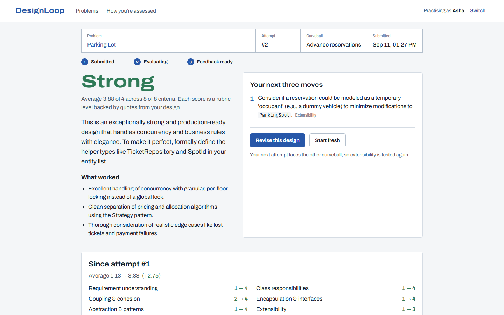
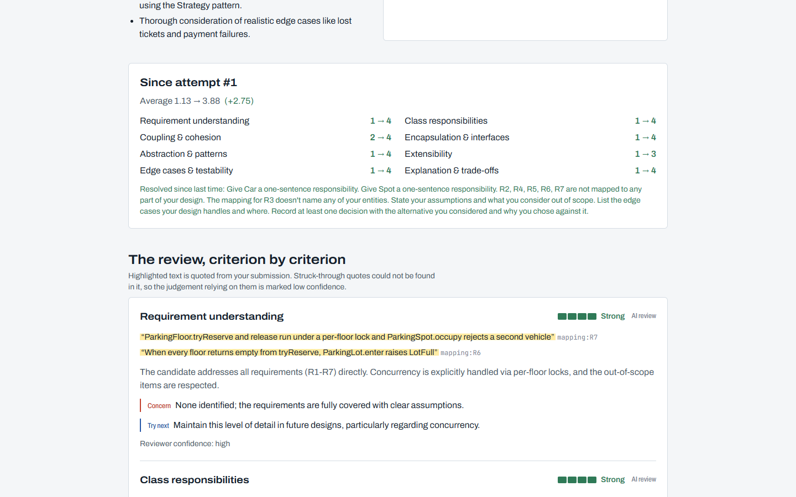
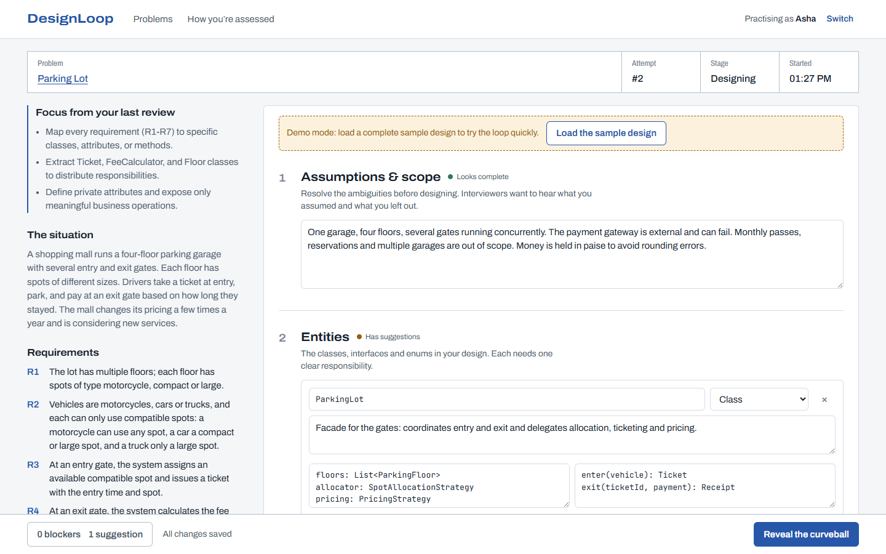
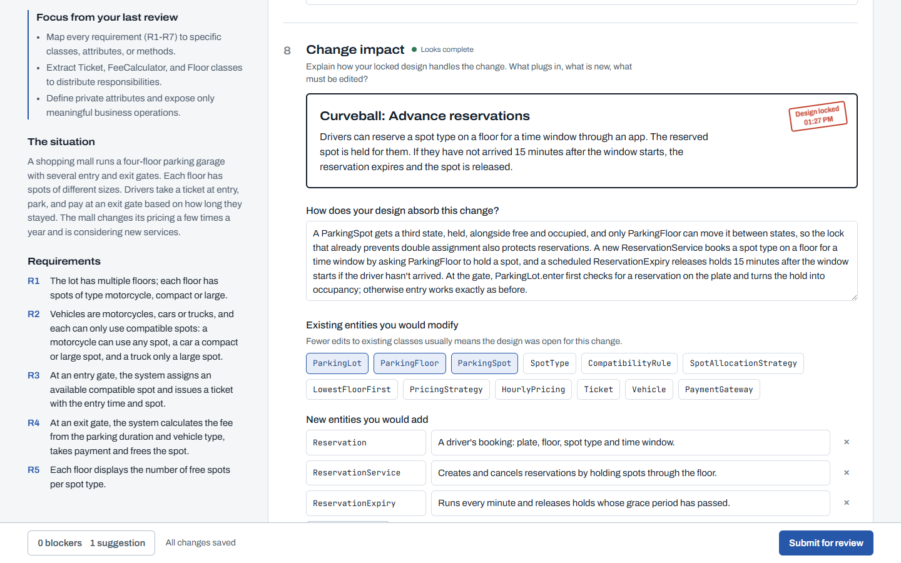
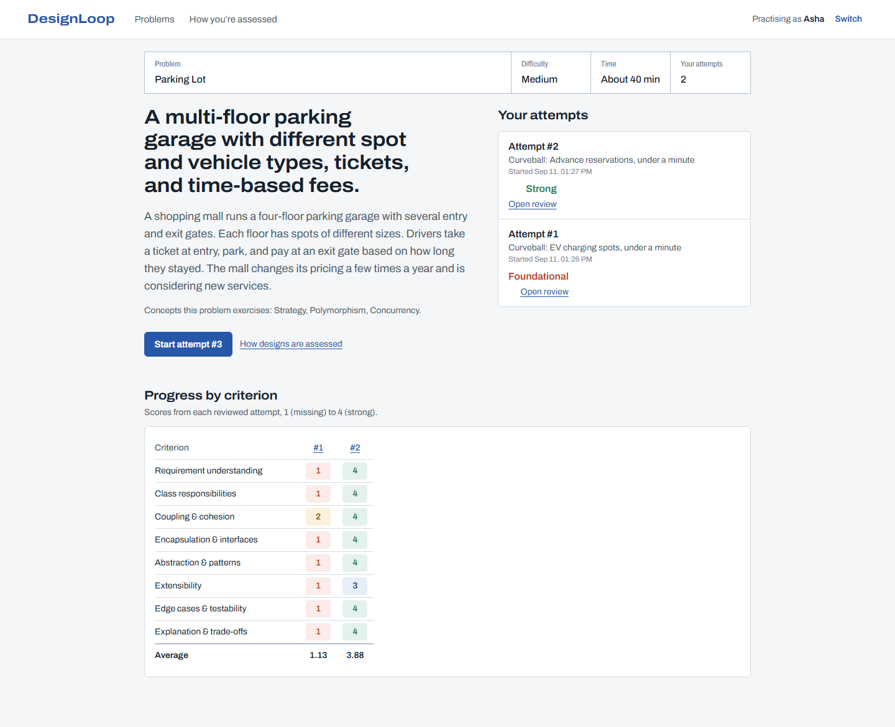

# DesignLoop

[](https://github.com/RepoRogue123/CipherSchools_LLD/actions/workflows/ci.yml)

Practise low-level design the way it is tested in interviews: design a system, then find out how it holds up when the requirements change.

Most LLD practice ends by comparing your design with a reference solution. That tells you your design is *different*, not whether it is *good*. DesignLoop reviews your design against a public rubric instead. Every judgement quotes your own words, and extensibility is tested with a change request you haven't seen.

## What's in this submission

| Deliverable | Where | What it covers |
|---|---|---|
| Research note | [docs/RESEARCH.md](docs/RESEARCH.md) | The learner problem, existing tools, key gaps, product direction |
| Design note | [docs/DESIGN.md](docs/DESIGN.md) | The MVP and user flow; classes and interfaces; evaluation approach; failure handling; the two change tests; trade-offs |
| Working prototype | this repo, see [Run it](#run-it) | The full loop: choose a problem, design, reveal the curveball, submit, get feedback, see history, try again |
| Tests | `server/test`, `web/src/**/*.test.tsx`, see [Tests](#tests) | 210 tests, including failure and edge cases |
| AI usage | [AI_USAGE.md](AI_USAGE.md) | Five AI-assisted decisions: what was suggested, what was accepted or rejected, and why |

## Screenshots

From a real run: two attempts at Parking Lot, both reviewed live by Gemini on the free tier.

**The review.** The band is computed from eight rubric levels, not an AI score out of 100. The next moves carry into the next attempt, and "Since attempt #1" shows what improved.



**Evidence-linked criteria.** Highlighted text is quoted from the learner's own design, and each quote is checked against it before it is shown.



**The workspace.** On the left, the brief and the focus goals carried over from the last review. On the right, the structured design document with live structure checks.



**The curveball.** Once revealed, the core design locks, and the learner explains which classes the change edits and which it adds.



**Progress.** Attempt history and scores by criterion.



## How the loop works

1. **Choose a problem.** There are four: Vending Machine, Parking Lot, Expense Sharing, Elevator. The rubric is public before you start.
2. **Design** in a guided document: assumptions, entities with responsibilities, relationships, requirement mapping, key flows, edge cases and decisions. Structure checks update as you type.
3. **Reveal the curveball**, for example "add EV charging billed per kWh". Your core design locks, and you explain which classes you would add and which you would have to edit.
4. **Submit.** The design is saved at once and reviewed in the background: Submitted, then Evaluating, then Feedback ready.
5. **Read the review.** Eight criteria, each scored 1–4 on described levels, with your own words quoted as evidence, plus a concern, a suggestion and your top three next moves.
6. **Try again.** Revise the design or start fresh. Your next moves are pinned, you face the problem's other curveball, and your history shows what improved.

## Run it

Requires **Node.js 22.13 or newer**, for the built-in `node:sqlite`. There are no native dependencies, database server or Docker.

```bash
npm install
cp .env.example .env      # optional: add a free LLM key to enable AI review (see below)
npm run dev               # API on :4000, web app on http://localhost:5173
```

To run the production build on a single port instead:

```bash
npm start                 # builds the web app, then serves everything on http://localhost:4000
```

The database is a single SQLite file at `server/data/designloop.db`, created on first run. Delete it to start over.

### Enable AI review (free keys)

Without a key the whole loop still works, with automated checks only and the rubric criteria unscored. To get AI review, put one or more free keys in `.env`. Providers are tried in order, and if one fails or is rate limited, the next one takes over.

| Provider | Get a free key | Variable |
|---|---|---|
| Google Gemini | https://aistudio.google.com/apikey | `GEMINI_API_KEY` |
| Groq | https://console.groq.com/keys | `GROQ_API_KEY` |
| OpenRouter (models ending in `:free`) | https://openrouter.ai/keys | `OPENROUTER_API_KEY` |
| Any OpenAI-compatible endpoint (e.g. local Ollama) | n/a | `CUSTOM_LLM_BASE_URL`, `CUSTOM_LLM_MODEL` |

Free-tier quotas are **per model**, so `GEMINI_MODEL`, `GROQ_MODEL` and `OPENROUTER_MODEL` each accept a comma-separated list, and every model becomes its own step in the fallback chain:

```bash
GEMINI_MODEL=gemini-3.6-flash,gemini-3.5-flash,gemini-flash-latest
```

A model whose daily quota is used up is skipped for an hour. Model ids change often (Google retired `gemini-2.5-flash` for new keys during this project), so check what your keys can use:

```bash
npm run smoke:llm                     # one structured call per configured provider and model
npm run smoke:llm -- --list-models    # also list the model ids each key can use
```

## A five-minute tour

1. Open http://localhost:5173 and enter a name. This is a profile, not a login.
2. Choose **Parking Lot** and start an attempt. The brief is on the left; open the clarifying questions to see the interviewer's answers.
3. To skip the typing, add `?demo` to the attempt URL (for example `http://localhost:5173/attempts/<id>?demo`) and click **Load the sample design**.
4. Open the checks panel (bottom left) to see blockers and suggestions. When there are no blockers, click **Reveal the curveball**.
5. Describe the change impact (in demo mode, click **Load the sample change impact**) and click **Submit for review**.
6. Read the review, then click **Revise this design**. Your next moves are pinned, and you face the other curveball.
7. The problem page shows your attempts and a table of scores by criterion. After a few weak reviews, recurring gaps appear on the home page.

## Key decisions

Each of these is explained, with its alternatives, in [DESIGN.md](docs/DESIGN.md).

1. **A structured design document as the submission.** It is the smallest format in which every rubric criterion has something to quote. It is language-agnostic, needs no code sandbox, and is exact to check. [§3](docs/DESIGN.md#3-the-submission-format)
2. **The curveball.** Revealing an unseen change and locking the design turns extensibility from a claim into something observable: which classes the change edits, and which it adds. The next attempt gets the problem's other curveball.
3. **A rubric, not a reference answer.** There are eight criteria, each with described levels, plus reviewer notes on what varies in each problem. The overall band is computed from the criteria, so there is no AI "score out of 100". [§6](docs/DESIGN.md#6-evaluation-approach)
4. **A clear split between deterministic checks and AI.**
   - Plain code checks structure, requirement coverage and consistency on every save, and caps scores when evidence is missing.
   - The AI judges quality, and must quote the design before scoring.
   - Every quote is checked against the submission.
5. **Store first, then evaluate asynchronously.**
   - Submitting saves the design and queues its review in one transaction, then returns straight away.
   - A database-backed worker retries with backoff, and keeps the automated feedback if the AI fails.
   - It recovers jobs whose worker died, and ignores duplicate submits. [§7](docs/DESIGN.md#7-failure-handling-and-idempotency)
6. **Free-tier providers behind one adapter.**
   - One OpenAI-compatible client covers Gemini, Groq, OpenRouter and local models.
   - A per-model fallback chain keeps reviews flowing when a free tier is busy or out of quota.
7. **A monolith with two extension points.** It runs as one Node process with SQLite. `Evaluator` and `DesignFormat` let a rule-based or human reviewer, or a class-diagram submission, be added without touching the practice flow. [§9](docs/DESIGN.md#9-change-tests)

## How it's built

A TypeScript monorepo (npm workspaces): an Express API with an in-process evaluation worker, SQLite, and a React client.

```
content/   problems (JSON), rubric v1, example designs
shared/    API contract: Zod schemas and DTO types used by both server and web
server/    domain (Attempt, Submission, Evaluation, Rubric…), evaluation engine (structural
           checks, AI rubric reviewer, evidence verifier, feedback assembler, pipeline),
           application services, SQLite repositories, LLM clients, HTTP API
web/       React + Vite + TanStack Query + Tailwind
docs/      RESEARCH.md, DESIGN.md, screenshots
```

The domain layer has no framework imports. `server/src/container.ts` is the only file that knows every concrete class. The class diagram, the state machines and a per-class responsibility table are in [DESIGN.md §4–5](docs/DESIGN.md#4-domain-model).

## Tests

```bash
npm test            # 201 server tests (unit, integration, HTTP) + 9 web component tests
npm run check       # lint, typecheck, test and build: the same steps CI runs on every push
npm run calibrate   # with an AI key: strong vs weak design, repeated runs, score spread
```

Server tests run against real SQLite (in memory) and a scripted model. They cover the important behaviour: the attempt and evaluation state machines, every structural check and cap, feedback assembly, and the full practice loop over HTTP.

**Failure and edge cases covered:**

| Situation | Expected behaviour |
|---|---|
| AI provider outage | Retried with backoff, then "Review incomplete" with the automated feedback kept; a learner retry completes it |
| Server crash mid-review | The job's lease expires and it is re-queued and finished; completed steps are not re-run |
| Double submit | The same submission and evaluation come back (`200`, not a second `202`) |
| Two tabs editing one attempt | The stale save is rejected with `409` |
| Two workers claiming one job | Only one wins |
| The model invents a quote | The quote is flagged and the reviewer's confidence is lowered |
| Reply missing a criterion, or out-of-range score | One repair prompt, then the next provider |
| Provider errors | Handled: `429` with retry hints, exhausted daily quotas, `401`/`403`, Gemini's `400` for a bad key, `5xx`, timeouts, network failures |
| Revealing or submitting too early | The curveball and submit gates refuse, and the locked design can't be edited |
| Bad requests | Invalid JSON gives `400`, a malformed design `422`, an unknown learner `401`, someone else's attempt `404` |
| Malformed problem content | Rejected when the server boots |

**Live verification**, run against the real free tiers and recorded in [DESIGN.md §6](docs/DESIGN.md#calibration):
- **Calibration:** the strong example design scored 4.00 in all three runs and the weak one 1.38–1.50, and every quote was verified.
- **Browser run:** the full loop went from 1.13 to 3.88 across two attempts.
- **Drills:** a crash-recovery drill and a provider-fallback drill both passed.

## Limitations

- **Identity, not authentication.** A learner is identified by an id in a request header, which can be spoofed. That is fine for a prototype, not for production.
- **One process, and polling.** The worker runs inside the API process, and the feedback page polls every 1.5 s rather than receiving pushed updates. [DESIGN.md §10](docs/DESIGN.md#10-scaling) covers what to separate first.
- **Free tiers are uneven.** Expect rate limits, busy spells and per-model daily quotas, with reviews taking 1–30 s. Some free tiers may use prompts to train their models.
- **Scores depend on the model.** Each report records its provider, model and prompt version, but the fallback chain means two attempts may be reviewed by different models.
- **Evidence checking is lexical.** A verified quote proves the words are in the design, not that the judgement drawn from them is right.
- **Heuristics are approximate.** The class-like-name check and the god-class check only warn; they never block.
- **Content lives in JSON files**, with no authoring UI. The demo sample exists only for Parking Lot.
- **Calibration is narrow.** It covers one problem and two designs, and agreement with human interviewers hasn't been measured yet.

## AI usage

The project was built with an AI coding assistant as a pair programmer, and it uses free-tier LLMs as the design reviewer. [AI_USAGE.md](AI_USAGE.md) covers five decisions where AI suggestions were accepted or rejected, and why. Among them:
- a paid single-vendor model was rejected in favour of a free multi-provider fallback;
- three of the assistant's own assumptions were overturned by live runs against the real services.
