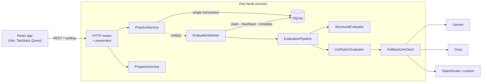
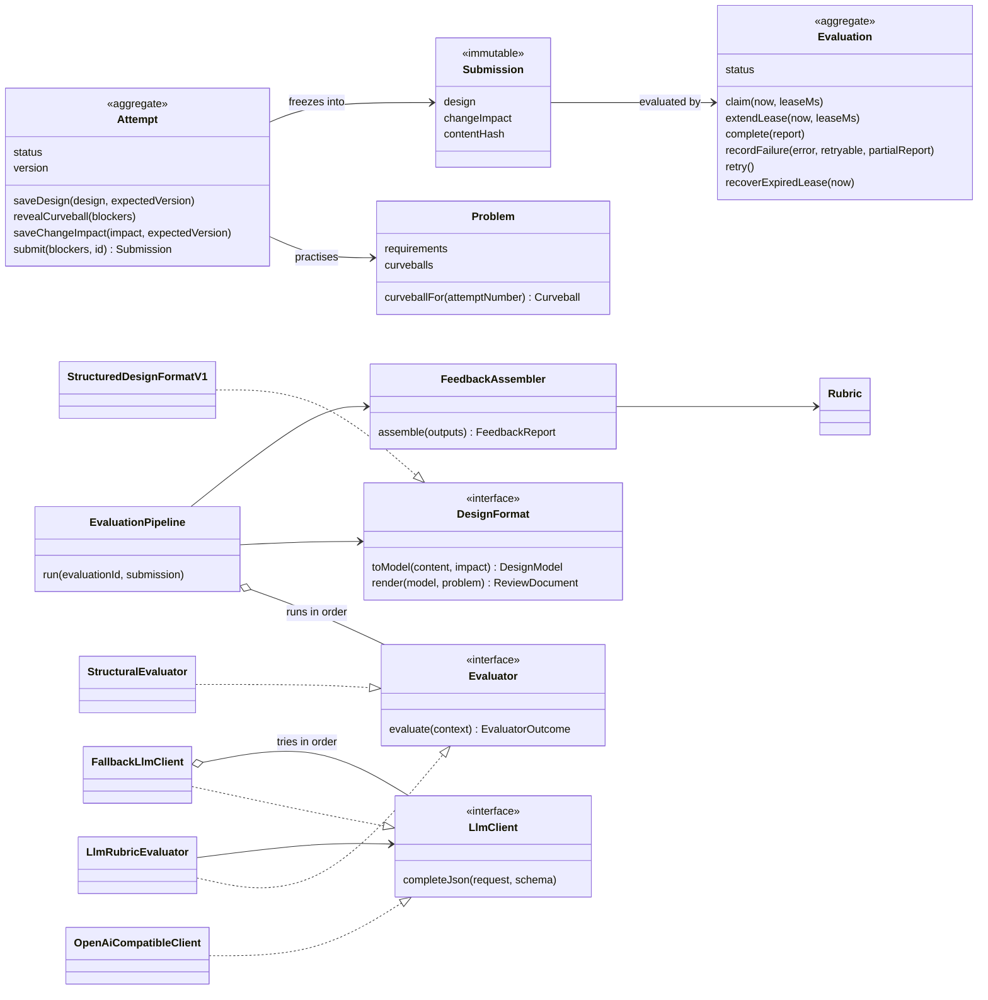
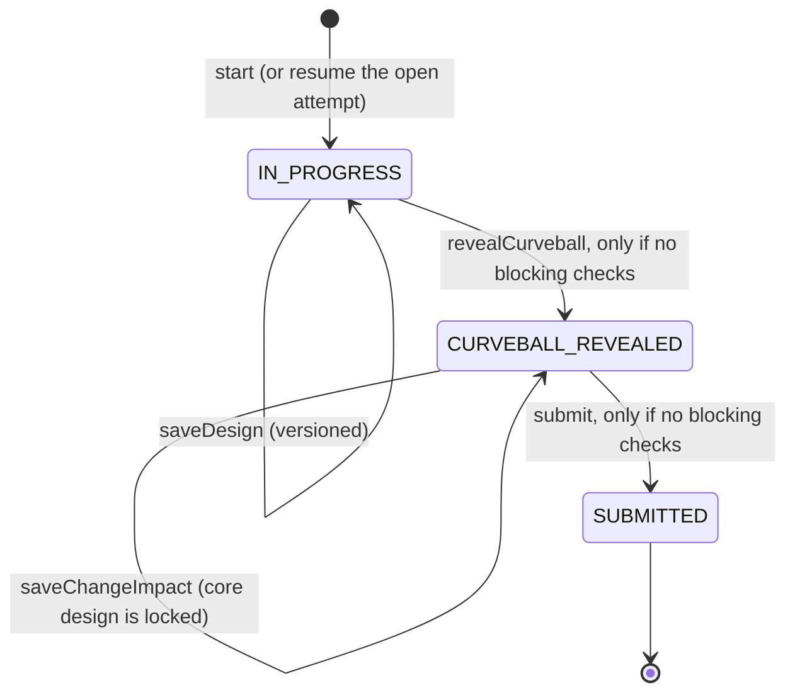
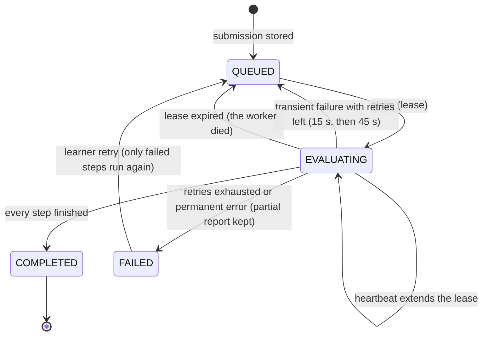

# Design

DesignLoop helps a learner practise low-level design and get feedback they can act on. The practice loop:

**Choose a problem → design → reveal the curveball → submit → read the review → try again.**

The curveball is the product's central idea. When the learner finishes their design, they reveal a change request they have not seen, for example "add EV charging spots billed per kWh". Their core design locks, and they explain how it absorbs the change: which existing classes they would edit and which new ones they would add. That turns extensibility from a claim into something the reviewer can observe. The next attempt faces the problem's other curveball.

Contents:

1. [MVP scope](#1-mvp-scope)
2. [Architecture](#2-architecture)
3. [The submission format](#3-the-submission-format)
4. [Domain model](#4-domain-model)
5. [Lifecycles](#5-lifecycles)
6. [Evaluation approach](#6-evaluation-approach)
7. [Failure handling and idempotency](#7-failure-handling-and-idempotency)
8. [Answers to the five design questions](#8-answers-to-the-five-design-questions)
9. [Change tests](#9-change-tests)
10. [Scaling](#10-scaling)
11. [Trade-offs and limitations](#11-trade-offs-and-limitations)

## 1. MVP scope

Each step of the practice loop maps to one feature. Anything that did not improve the loop was left out.

| Loop step | What the learner gets |
|---|---|
| Choose a problem | Four problems of increasing difficulty (Vending Machine, Parking Lot, Expense Sharing, Elevator). The rubric is public before starting, and recurring weak criteria are shown on the home page. |
| Think and design | A brief with requirements `R1..Rn`, out-of-scope items, and clarifying questions whose "interviewer answers" open on demand. A structured design editor with structure checks that update on every autosave. |
| Curveball | Unlocks once the structure checks pass. The change request appears and the core design locks. The learner describes the change impact. |
| Submit | Returns immediately; the review runs in the background. Status goes Submitted → Evaluating → Feedback ready (or Review incomplete). |
| Get feedback | Each rubric criterion is scored 1–4 with the level's name, highlighted quotes from the learner's own design, a concern, a suggestion and a confidence. Automated caps show their reason. Also shown: the top three next moves, what reviewers look for in the problem, and alternative designs with their trade-offs. |
| Review | Comparison with the previous attempt, and a criterion-by-attempt history table. |
| Try again | "Revise this design" (seeded with the submitted design) or "Start fresh". The previous next moves are pinned as focus goals, and the other curveball is used. |

**Deliberately out of scope:** authentication (a name-only profile identifies the learner), code or diagram input, a human-review UI, content authoring, gamification, and any distributed infrastructure.

## 2. Architecture

A single Node process is enough: an Express API, an in-process evaluation worker, and SQLite. Every part of the brief that is about scale (slow AI calls, failures, retries) is handled inside that one process.



Code layout (server):

```
server/src/
  domain/          Problem, Attempt, Submission, Evaluation, Rubric, Learner, errors,
                   ports (repository and service interfaces), Evaluator and DesignFormat seams
  evaluation/      the evaluation engine: format adapter, structural checks, LLM reviewer,
                   evidence verifier, feedback assembler, pipeline
  application/     PracticeService, EvaluationWorker, ProgressService
  infrastructure/  SQLite repositories and migrations, LLM clients, file-based problem catalog
  http/            routes, presenters (domain → DTO), error mapping
  container.ts     composition root: the only file that knows every concrete class
```

Dependencies point inward. `domain/` imports nothing from the other folders, `evaluation/` and `application/` depend on domain ports, and only `infrastructure/` and `container.ts` touch SQLite, `fetch` or the file system. The `shared/` package is the API contract (Zod schemas and DTO types) used by both server and web.

## 3. The submission format

A learner submits a **structured design document** (`structured-design/v1`). Each section exists because at least one rubric criterion needs it as evidence:

| Section | Shape | Evidence for |
|---|---|---|
| Assumptions & scope | text | Requirement understanding |
| Entities | name, kind (class / interface / abstract / enum), responsibility, attributes, methods | Responsibilities, encapsulation, abstraction |
| Relationships | from, type (inherits / implements / composes / aggregates / associates / depends), to, note | Coupling and cohesion, abstraction |
| Requirement mapping | one answer per requirement: which classes and methods satisfy it | Requirement understanding |
| Key flows | named use cases, step by step | Responsibilities, coupling |
| Edge cases & failure handling | text | Edge cases and testability |
| Decisions & trade-offs | decision, alternative considered, rationale | Explanation and trade-offs, abstraction |
| **Change impact** (after the curveball) | approach, existing entities modified, new entities added, risks | Extensibility |

Why this format and not code or a diagram:

- It is **sufficient**: every criterion has a section to quote from.
- It is **language-agnostic**: no sandbox, and no mixing of Java fluency with design skill.
- It **mirrors the interview**: this is the conversation that happens before code.
- It is **checkable**: because the input is structured, the deterministic checks are exact rather than heuristic guesses over free text.

The schema enforces shape and size only (`shared/src/design.ts`). An unfinished draft is still valid. Completeness is judged by the structural checks, which advise rather than reject.

## 4. Domain model



### Each class, and why it exists

The guide asks five questions of every class: its responsibility, its behaviour, its dependencies, what is likely to change, and whether it is needed at all. The table answers them.

| Class | Responsibility | Behaviour it owns | Depends on | Likely to change | Why it exists |
|---|---|---|---|---|---|
| `Problem` | One practice problem's content | `curveballFor(attemptNumber)` rotates curveballs per attempt | nothing | Content | One source of truth for requirements, reviewer notes and curveballs |
| `Attempt` (aggregate) | One learner's attempt at one problem | Design editing, the curveball gate and lock, the submit gate, optimistic versioning | `Problem`, `Submission` | Practice rules | All practice rules live in one testable place with no framework in sight (`domain/attempt.ts`) |
| `Submission` | Frozen snapshot of what was submitted | Deep-frozen on creation; content hash over canonical JSON | nothing | Nothing (immutable) | Feedback must refer to exactly what was reviewed, even after retries |
| `Evaluation` (aggregate) | The review job for one submission | Claim with lease, heartbeat, complete, fail with backoff, learner retry, crash recovery | `RetryPolicy` | Retry policy | Slow, failing work is kept separate from `Attempt`, so practice never waits on it |
| `Rubric` | Versioned criteria with described levels | Level labels, criterion lookup | nothing (data file) | Wording, criteria | Consistency comes from data, not prompt prose; evaluations record the version |
| `DesignFormat` (interface) | Turn one submission format into a `DesignModel` and anchored review text | `toModel`, `render` | `Problem` | New formats | Evaluators never read the raw format (Change Test A) |
| `Evaluator` (interface) | One way of judging a design | `evaluate(context)` | the context | New evaluators | Deterministic checks and AI review are two implementations; rule packs or human review plug in beside them (Change Test B) |
| `StructuralEvaluator` | Deterministic checks | Findings, metrics, score caps | `checkDesign` | Rules | Free, instant, exact; runs on every autosave too |
| `LlmRubricEvaluator` | Judgement-heavy criteria | Prompt, schema-validated reply, evidence verification, confidence downgrade | `LlmClient` | Prompt, provider | Uses AI only where reasoning helps |
| `LlmClient` (interface) | A schema-validated JSON completion | `completeJson(request, schema)` | nothing | Providers | Lets the fallback chain wrap providers; tests use a scripted fake |
| `OpenAiCompatibleClient` | One OpenAI-compatible endpoint | HTTP error classification, one repair attempt on bad output, key redaction | `fetch` | Provider quirks | One adapter covers Gemini, Groq, OpenRouter and local models |
| `FallbackLlmClient` | Keep reviews flowing on free tiers | Tries providers in order; cools down rate-limited ones | `LlmClient[]`, `Clock` | Policy | Free tiers hit rate limits often; this stops one provider's limit from blocking feedback |
| `EvaluationPipeline` | Run evaluators for one submission | Persists each step; re-runs skip completed steps; builds a partial report on failure | Evaluators, repository, `FeedbackAssembler` | Evaluator order | Makes retries idempotent, and keeps a failed AI step from losing the deterministic feedback |
| `FeedbackAssembler` | Decide what the learner sees | Precedence (human > AI > deterministic), caps, overall band, next steps | `Rubric` | Merge policy | One place that turns evaluator outputs into a report; never a free-floating AI number |
| `PracticeService` | Practice use cases | Load, change and save aggregates in transactions; turn duplicate submits into reads; authorise | Repositories, `TransactionRunner` | Use cases | Keeps orchestration out of both the aggregates and the HTTP layer |
| `EvaluationWorker` | Process queued evaluations | Claim, heartbeat, run the pipeline, record the outcome, recover expired leases | Repository, pipeline | Concurrency | The asynchronous half of "don't block the submit request" |
| `ProgressService` | Read models for the learning loop | History, attempt comparison, recurring weaknesses | Repositories, `Rubric` | Heuristics | Deterministic and explainable progress; no model calls |

### Deliberately not abstracted

- **No DI container.** `container.ts` wires everything by hand in about 80 lines. That is easier to read than a container.
- **No event bus or workflow engine.** The worker is woken with a direct `notify()` call, and the DB poll is the safety net.
- **One rubric for all problems.** Per-problem reviewer notes (design pressures and edge cases) steer it. A rubric per problem would multiply content without improving consistency.
- **Synchronous repository ports.** The embedded SQLite driver is synchronous, which keeps multi-repository transactions atomic and simple (`SqliteTransactionRunner` refuses async work). Moving to Postgres would make the ports async, a mechanical change at that boundary.
- **Only one `DesignFormat` implementation today.** The interface is kept because it also keeps the evaluators independent of the input format, and they are tested against `DesignModel` directly.

## 5. Lifecycles

**Attempt**. Rules are enforced in `domain/attempt.ts`:



**Evaluation**. Rules are enforced in `domain/evaluation.ts`:



The learner sees `QUEUED` as "Submitted" and `FAILED` as "Review incomplete".

## 6. Evaluation approach

### Rubric

Eight criteria, taken directly from the dimensions the brief lists: requirement understanding, class responsibilities, coupling and cohesion, encapsulation and interfaces, abstraction and patterns, extensibility, edge cases and testability, and explanation and trade-offs. Each is scored **1 Missing · 2 Emerging · 3 Solid · 4 Strong**, with a description for every level (`content/rubric.v1.json`). The overall result is the mean of the assessed criteria, mapped to a band (Strong ≥ 3.5, Solid ≥ 2.75, Developing ≥ 2.0, otherwise Foundational). It is computed deterministically; there is no AI "score out of 100".

### What is deterministic and what uses AI

| Deterministic (`evaluation/structural/checks.ts` and the domain) | AI (`evaluation/llm/`) |
|---|---|
| Required structure: at least 3 entities, at least one flow, unique names, no dangling relationships (these gate the curveball) | Quality of responsibilities and cohesion |
| Change impact present and consistent (gates submission) | Coupling and whether abstractions sit at real variation points |
| Requirement traceability: which `R#` are mapped, and whether mappings name real entities | Encapsulation and interface quality |
| Class-like names used but never declared; orphan entities; god-class signal | Credibility of the change-impact explanation (extensibility) |
| Metrics: counts, requirement coverage, **blast radius** (entities modified vs added by the curveball) | Edge-case handling and testability |
| **Score caps** when evidence is plainly missing (below) | Quality of trade-off reasoning |
| **Evidence verification**: every quote is checked against the submission | Specific suggestions and a short summary |
| State transitions, idempotency, retries, history and weakness aggregation | |

The AI never decides a workflow rule, and deterministic code never judges design quality.

### Caps: deterministic guardrails on AI scores

| Criterion | Capped at | When |
|---|---|---|
| Requirement understanding | 2 | Fewer than half of the requirements are mapped |
| Class responsibilities | 2 | More than a third of entities have no responsibility statement |
| Explanation & trade-offs | 2 | No decision records both an alternative and a rationale |
| Edge cases & testability | 2 | The edge-case section is empty |
| Extensibility | 2 | The change impact names no class it modifies or adds |

A cap only ever lowers a score. The report shows the reviewer's original score and the reason ("Capped at 2 by an automated check (the reviewer gave 4): only 1 of 7 requirements are mapped").

### Making AI feedback consistent

- **Fixed rubric with described levels** in the prompt, never an open question like "is this good?".
- **Reviewer notes per problem**: what varies in the problem (design pressures), known edge cases, and what the curveball tests. These let the model judge "abstraction at the right place" without a reference solution.
- **Automated facts** from the structural checks are given to the model, so it doesn't have to count or guess.
- **Evidence first**: the output schema asks for quotes, then reasoning, then the score, for every criterion.
- **Structured output** validated by a Zod schema. A missing criterion or an out-of-range score gets one repair attempt, then the next provider is tried.
- **Low temperature** (0.2) and a versioned prompt (`lld-review/v1`), recorded with every report along with the provider and model.
- **Evidence verification** (`evidence-verifier.ts`): a quote counts only if it appears in the text the model was shown, either verbatim (ignoring case and punctuation) or near-verbatim (at least 80% of its words) within the section it cites. Unverified quotes are struck through in the UI, and a score of 3+ with no verified evidence is shown as low confidence.
- **Prompt-injection hygiene**: the submission is fenced as data, and caps bound the result anyway.

### Calibration

`npm run calibrate` runs the real evaluators on two example Parking Lot designs in `content/examples/`: a deliberately strong one and a deliberately weak one (a god class, no edge cases, and a change handled with an if-statement). By default it runs each three times and reports:

- the score for every criterion on every run;
- the largest spread for one criterion across repeated runs of the same design;
- whether every strong run outscored every weak run.

The deterministic half is already covered by tests (`calibration-fixtures.test.ts`): the strong design clears every gate and cap, and the weak design is capped on requirements, robustness and trade-offs.

**Results from a live run** (11 September 2026, Gemini free tier, `gemini-3.5-flash`, 3 runs per design):

| Design | Mean per run | Band | Quotes verified |
|---|---|---|---|
| Strong | 4.00, 4.00, 4.00 | Strong | 16/16 in every run |
| Weak | 1.38, 1.50, 1.38 | Foundational | 11/11, 10/10, 10/10 |

| Criterion | Strong runs | Weak runs |
|---|---|---|
| Requirement understanding | 4 4 4 | 1 1 1 |
| Class responsibilities | 4 4 4 | 1 1 1 |
| Coupling & cohesion | 4 4 4 | 2 2 2 |
| Encapsulation & interfaces | 4 4 4 | 2 2 2 |
| Abstraction & patterns | 4 4 4 | 1 1 1 |
| Extensibility | 4 4 4 | 1 2 1 |
| Edge cases & testability | 4 4 4 | 1 1 1 |
| Explanation & trade-offs | 4 4 4 | 2 2 2 |

- **Separation:** every strong run outscored every weak run, by an average of 2.58 levels.
- **Consistency:** across repeated runs of the same design, 15 of the 16 criterion rows never moved. The one change was a single level (extensibility on the weak design).
- **Evidence:** every quote matched the submission in these runs.
- **Earlier run on `gemini-3.6-flash`:** before its free daily quota ran out, the strong design scored 3.88–4.00 across five runs and the weak design 1.00 in its one run. In one run the verifier flagged 1 of 21 quotes as not present in the submission, and it was shown as such.

**The full loop in the browser, with real AI review:**

- **Attempt 1, the weak design:** 1.13 (Foundational). The reviewer named the god class and suggested extracting `Ticket`, a fee calculator and `Floor`.
- **Attempt 2, the strong design:** reached through "Revise this design" and facing the reservations curveball, it scored 3.88 (Strong). Extensibility got 3 rather than 4, with a concrete suggestion for absorbing reservations with fewer edits.
- **Comparison:** "Since attempt #1" showed +2.75, every criterion improved, and 7 structural findings resolved.
- **Fallback:** `gemini-3.6-flash` had spent its daily quota, so the chain moved on and `gemini-3.5-flash` did both reviews.

**What live testing changed:**

- **A retired model.** Google had retired the original default model (`gemini-2.5-flash`) for new keys, so `*_MODEL` now accepts a list and the default chain ends with the `gemini-flash-latest` alias.
- **Invalid keys return 400.** Gemini rejects a bad key with HTTP 400, not 401, so that response is now classified as an auth failure.
- **Busy spells.** Free tiers return 503 "high demand" in bursts, which confirmed the need for backoff and fallback.
- **Per-model quotas.** Quotas apply per model, so chaining models on one key multiplies free capacity. A daily-quota 429 now pauses that model for an hour instead of the few seconds the provider suggests.

## 7. Failure handling and idempotency

| Situation | What happens |
|---|---|
| AI is slow | Submit returns `202` straight away. The worker runs in the background and the page polls every 1.5 s. The learner can leave and come back. |
| A provider is rate limited (429) | The fallback client cools that provider down (using `Retry-After` or Gemini's `retryDelay` when given) and tries the next one. |
| Every provider fails transiently | The evaluation is re-queued with backoff (15 s, then 45 s). After that it is `FAILED` with a **partial report**: the deterministic feedback, which the learner still sees. |
| A provider key is wrong (401/403) or the model is unknown (404/400) | That provider is skipped (auth errors cool it down for 10 minutes). If nothing else works, the error is treated as non-retryable, so there's no pointless backoff. |
| The model returns invalid JSON or skips a criterion | One repair prompt listing the validation errors, then the next provider. |
| No provider is configured | The AI step is `SKIPPED` and the evaluation `COMPLETED`s with deterministic feedback and a clear banner. |
| The server crashes mid-review | The claimed job's lease (renewed by a heartbeat while alive) expires, and the job is re-queued on the next poll. Completed steps are not re-run. |
| A double-clicked submit or a network retry | The attempt is already `SUBMITTED`, so the original submission and evaluation are returned with `200`. The database also enforces one submission per attempt and one evaluation per submission. |
| Two workers claim the same job | Saves are compare-and-set on a `version` column, so the second claim gets `VersionConflict` and moves on. |
| Two browser tabs edit one attempt | Autosave sends the version it's based on. The stale tab gets `409` and is asked to reload instead of overwriting. |
| Starting an attempt twice | The open attempt is resumed. A partial unique index enforces "one open attempt per learner and problem". |
| Retrying a review that isn't failed | No-op; the current state is returned. |

The submission is stored, and its evaluation queued, in **one transaction before any evaluator runs**, so nothing is lost if evaluation fails.

## 8. Answers to the five design questions

**1. What does a learner need to provide for an attempt to be meaningful?**
Scope and assumptions; entities with explicit responsibilities; relationships; requirement traceability; behaviour in the form of key flows; edge cases; decisions with the alternative rejected; and an answer to a change they had not seen. Without flows the design is just a list of nouns. Without decisions a deliberate choice can't be told from an accident. Without the curveball, "extensible" is only a claim. The platform keeps the immutable submitted snapshot and its hash, the timestamps (started, curveball revealed, submitted), the structural findings and metrics, and every evaluator's output with the provider, model, prompt version and rubric version.

**2. What makes feedback useful when more than one design is valid?**
Scoring *properties* against a rubric, informed by the problem's design pressures, never class names or a reference answer. Each judgement quotes the learner's own design, and those quotes are verified. The curveball adds a behavioural test that every design faces equally. After review, the learner sees alternative designs with their trade-offs, framed as alternatives rather than answers.

**3. Which parts should be deterministic, and which benefit from an LLM?**
See the table in §6. In short: facts and rules are deterministic (structure, traceability, consistency, metrics, caps, evidence verification, state, idempotency, history). Judgements go to the LLM (responsibility quality, coupling, abstraction, trade-offs, extensibility credibility, suggestions).

**4. How would the design accommodate another evaluation approach or submission format?**
Through two seams: `DesignFormat` for formats and `Evaluator` for evaluation approaches. See §9 for the exact files.

**5. What should happen if evaluation takes time or fails?**
Store first, evaluate asynchronously, show a clear status, retry transient failures with backoff and provider fallback, keep partial deterministic feedback on failure, let the learner retry only the failed part, and recover abandoned jobs through leases. See §7.

## 9. Change tests

### A. "Today the learner submits text. Later, a class diagram."

What changes:

1. A new `ClassDiagramFormat implements DesignFormat<ClassDiagramContent>` in `server/src/evaluation/formats/`. It parses the diagram (for example Mermaid `classDiagram` text) into the same `DesignModel` (entities, relationships) and renders anchored review text.
2. One line in `server/src/container.ts` to register it in the `DesignFormatRegistry`.
3. `shared/src/design.ts`: the submission content becomes a union discriminated by `format`, and `Submission.design` widens with it.
4. A diagram editor component in the web app.

What does not change: `Attempt` and `Evaluation` and their lifecycles, the worker, the pipeline, `StructuralEvaluator` and `LlmRubricEvaluator` (both read `DesignModel`), `FeedbackAssembler`, `ProgressService`, the rubric and the API shape.

One honest caveat: a diagram shows structure, not reasoning. A diagram-only format would trip the text-section checks (flows, decisions), so the realistic second format is "diagram plus the text sections".

### B. "Today feedback comes from one evaluator. Later, a rule-based evaluator or human review."

**Rule-based evaluator**, for example per-problem rules such as "the vending machine must make illegal actions state-dependent":

1. `class ProblemRulesEvaluator implements Evaluator` returning findings, caps or `deterministic` assessments.
2. Add it to the `evaluators` list in `server/src/container.ts`.

Nothing else changes. The pipeline persists its step and skips it on retries, and the assembler merges it by precedence.

**Human review:**

1. A `HumanReviewEvaluator` whose step waits for input. This needs one new step status (for example `AWAITING_REVIEW`) and the report marked partial until the reviewer responds.
2. A `ReviewService.submitReview(evaluationId, assessments)` use case that stores the step output and re-runs assembly. `FeedbackAssembler` already gives `human` precedence over `ai`.
3. A reviewer screen.

The practice flow is untouched either way: the learner still designs, reveals, submits and reads a report.

## 10. Scaling

What the prototype does today: one process, the worker in-process with concurrency 1 (to respect free-tier rate limits), SQLite in WAL mode, and polling.

The **first thing to separate is the evaluation worker**, moved into its own process. AI latency and rate limits are the bottleneck, and they scale independently of API traffic. The code is already shaped for it:

- the queue is the `evaluations` table;
- claims are compare-and-set;
- leases and heartbeats handle a worker dying;
- the API only calls `notify()`, which becomes a no-op or a queue ping.

After that, in order:

1. Postgres, with `SELECT … FOR UPDATE SKIP LOCKED` for claims.
2. Server-sent events instead of polling.
3. A per-provider token bucket shared by the workers.
4. Paid-tier or self-hosted models for predictable latency.

Nothing here needs microservices.

## 11. Trade-offs and limitations

- **Identity, not authentication.** The `X-Learner-Id` header can be spoofed. That is fine for a prototype, not for production.
- **Evidence verification is lexical.** A verified quote proves the words are in the submission, not that the judgement drawn from them is right.
- **Structural heuristics are approximate.** Class-like name detection and god-class thresholds only ever warn; they never block.
- **The curveball lock is strict.** A learner who spots a mistake after the reveal can't fix it in that attempt. That is deliberate, since it mirrors an interview, and the next attempt starts from the submitted design.
- **Different models score differently.** Every report records the provider, model and prompt version, and comparisons flag rubric changes. The fallback chain means two attempts can be reviewed by different models.
- **Free-tier privacy.** Some free tiers may use prompts to improve their models, so learner designs are sent to a third party.
- **Content is a file format, not a CMS.** Problems are JSON validated at boot, and there is no authoring UI.
